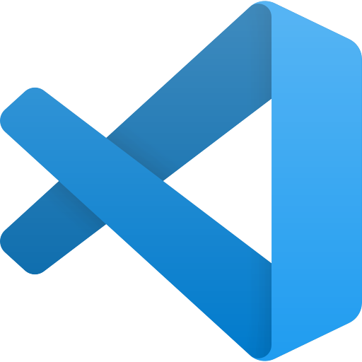

<!-- HEADINGS-->

# my title
## my title h2
### my title h3
#### my title h4
##### my title h5
###### my title h6

<!--italic-->
this is an *italic* text
<!--strong-->
this is an **strong** text
<!--strikethrough-->
esto es un ~~texto~~ tachado

<!--UL-->
* apple

    *apple 2
* orange

   *orange 2
* banana

1. apple
    1. apple 2
2. orange 
3. banana

[faztweb.com](https://www.faztweb.com)

[faztweb.com](https://www.faztweb.com "Custom title") 

>this is a quote

---
___

console.log (' Hello word')

``` javascript
<Script languaje="javascript">

  var getin = prompt("Necesitas una contraseña para acceder a este contenido.")

  if (getin!="Contraseña")

  {location.href='https://contraseña-equivocada.com'}

  else

  {alert('Contraseña correcta, acepta para ver el contenido')}

</Script>


```

```python
print ("Hello world")
```

```html
<h1>("Hello world")</h1>
```

|TABLES | ARE   | COOL

|-------------  |:------:|-----:|

| col 3 is  | centered  | $12|




<!-- GIFTHUB MARKDOWN-->
*[X] TASK 1

*[] TASK 2

*[] TASK 3

*[X] TASK 4